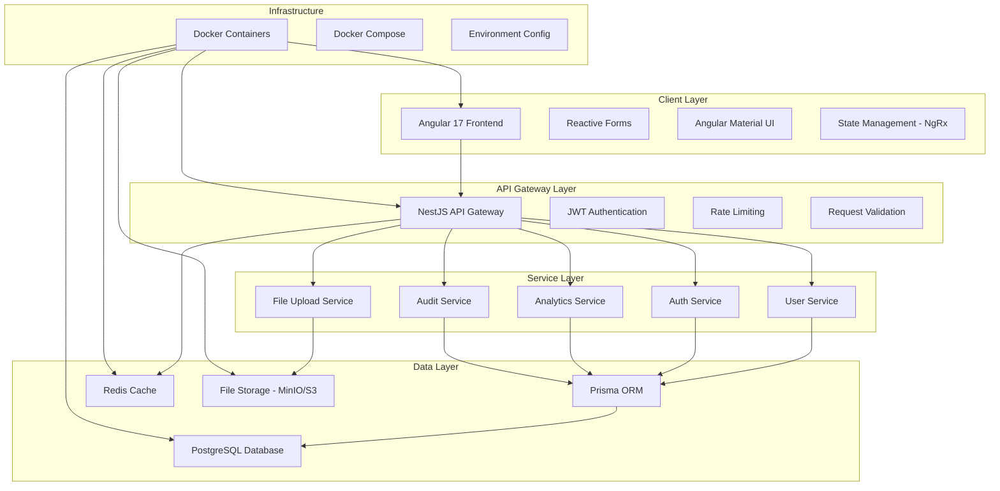

# Design Document

## Overview

The User Management System is a full-stack application built with modern technologies to provide comprehensive user lifecycle management. The system follows a microservices-inspired architecture with clear separation between frontend, backend API, and database layers. The design emphasizes security, scalability, and maintainability while providing rich user experience features.

## Architecture

### High-Level Architecture



### Technology Stack

**Frontend:**
- Angular 17 with TypeScript
- Angular Material for UI components
- NgRx for state management
- Angular Reactive Forms for form handling
- Chart.js for analytics visualization
- Angular CDK for advanced UI features

**Backend:**
- NestJS framework with TypeScript
- Prisma ORM for database operations
- Passport.js for authentication strategies
- JWT for token-based authentication
- Class-validator for input validation
- Multer for file upload handling

**Database & Storage:**
- PostgreSQL as primary database
- Redis for caching and session storage
- MinIO or AWS S3 for file storage

**Infrastructure:**
- Docker for containerization
- Docker Compose for local development
- Environment-based configuration

## Components and Interfaces

### Frontend Components

#### Core Components
```typescript
// User Management Components
UserListComponent - Display paginated user list with search/filter
UserFormComponent - Create/edit user reactive form
UserDetailComponent - Display detailed user information
UserProfileComponent - User profile management

// Authentication Components
LoginComponent - User login form
RegisterComponent - User registration form
PasswordResetComponent - Password reset request/update

// Admin Components
DashboardComponent - Analytics and system overview
BulkActionsComponent - Multi-user operations
AuditLogComponent - System activity logs
ImpersonationComponent - User impersonation interface

// Shared Components
PaginationComponent - Reusable pagination
SearchFilterComponent - Search and filter controls
ThemeToggleComponent - Dark/light mode switcher
```

#### Services
```typescript
// Core Services
UserService - User CRUD operations and management
AuthService - Authentication and authorization
AnalyticsService - Dashboard data and statistics
AuditService - Activity logging and retrieval
FileUploadService - Profile picture and file handling

// Utility Services
NotificationService - Toast notifications and alerts
LoadingService - Global loading state management
ThemeService - Theme switching and persistence
ValidationService - Custom form validators
```

### Backend API Structure

#### Controllers
```typescript
// Main Controllers
UsersController - User CRUD endpoints
AuthController - Authentication endpoints
AnalyticsController - Dashboard and statistics
AuditController - Audit log endpoints
ProfileController - User profile management

// Admin Controllers
AdminController - Administrative operations
BulkActionsController - Bulk user operations
ImpersonationController - User impersonation
```

#### Services
```typescript
// Business Logic Services
UsersService - User business logic and validation
AuthService - Authentication and JWT handling
AnalyticsService - Data aggregation and statistics
AuditService - Activity logging and querying
EmailService - Password reset and notifications

// Infrastructure Services
PrismaService - Database connection and queries
RedisService - Caching and session management
FileStorageService - File upload and management
SecurityService - Password hashing and validation
```

#### Guards and Middleware
```typescript
// Security Guards
JwtAuthGuard - JWT token validation
RolesGuard - Role-based access control
ThrottlerGuard - Rate limiting protection

// Middleware
LoggingMiddleware - Request/response logging
ValidationPipe - Input validation
AuditMiddleware - Activity tracking
```

## Data Models

### Database Schema

```prisma
// User Model
model User {
  id          String   @id @default(cuid())
  email       String   @unique
  name        String
  phone       String?
  password    String
  role        Role     @default(USER)
  status      UserStatus @default(ACTIVE)
  profilePicture String?
  address     String?
  createdAt   DateTime @default(now())
  updatedAt   DateTime @updatedAt
  lastLoginAt DateTime?
  
  // Relations
  auditLogs   AuditLog[]
  sessions    UserSession[]
  
  @@map("users")
}

// Enums
enum Role {
  ADMIN
  MANAGER
  USER
}

enum UserStatus {
  ACTIVE
  INACTIVE
  SUSPENDED
}

// Audit Log Model
model AuditLog {
  id          String   @id @default(cuid())
  action      String
  entityType  String
  entityId    String
  oldValues   Json?
  newValues   Json?
  userId      String?
  adminId     String?
  ipAddress   String?
  userAgent   String?
  createdAt   DateTime @default(now())
  
  user        User?    @relation(fields: [userId], references: [id])
  
  @@map("audit_logs")
}

// User Session Model
model UserSession {
  id          String   @id @default(cuid())
  userId      String
  token       String   @unique
  expiresAt   DateTime
  createdAt   DateTime @default(now())
  isActive    Boolean  @default(true)
  
  user        User     @relation(fields: [userId], references: [id], onDelete: Cascade)
  
  @@map("user_sessions")
}

// Password Reset Model
model PasswordReset {
  id          String   @id @default(cuid())
  email       String
  token       String   @unique
  expiresAt   DateTime
  used        Boolean  @default(false)
  createdAt   DateTime @default(now())
  
  @@map("password_resets")
}
```

### API Data Transfer Objects

```typescript
// User DTOs
export class CreateUserDto {
  @IsEmail()
  email: string;
  
  @IsString()
  @MinLength(2)
  name: string;
  
  @IsOptional()
  @IsPhoneNumber()
  phone?: string;
  
  @IsEnum(Role)
  role: Role;
  
  @IsString()
  @MinLength(8)
  @Matches(/^(?=.*[a-z])(?=.*[A-Z])(?=.*\d)(?=.*[@$!%*?&])[A-Za-z\d@$!%*?&]/)
  password: string;
}

export class UpdateUserDto {
  @IsOptional()
  @IsString()
  name?: string;
  
  @IsOptional()
  @IsPhoneNumber()
  phone?: string;
  
  @IsOptional()
  @IsEnum(Role)
  role?: Role;
  
  @IsOptional()
  @IsEnum(UserStatus)
  status?: UserStatus;
  
  @IsOptional()
  @IsString()
  address?: string;
}

// Authentication DTOs
export class LoginDto {
  @IsEmail()
  email: string;
  
  @IsString()
  password: string;
}

export class RegisterDto extends CreateUserDto {}

// Response DTOs
export class UserResponseDto {
  id: string;
  email: string;
  name: string;
  phone?: string;
  role: Role;
  status: UserStatus;
  profilePicture?: string;
  address?: string;
  createdAt: Date;
  lastLoginAt?: Date;
}
```

## Error Handling

### Error Response Structure
```typescript
export interface ApiErrorResponse {
  statusCode: number;
  message: string | string[];
  error: string;
  timestamp: string;
  path: string;
  correlationId: string;
}
```

### Error Categories
1. **Validation Errors (400)** - Invalid input data
2. **Authentication Errors (401)** - Invalid credentials or expired tokens
3. **Authorization Errors (403)** - Insufficient permissions
4. **Not Found Errors (404)** - Resource not found
5. **Conflict Errors (409)** - Duplicate email or constraint violations
6. **Rate Limit Errors (429)** - Too many requests
7. **Server Errors (500)** - Internal server errors

### Frontend Error Handling
- Global error interceptor for HTTP errors
- User-friendly error messages with internationalization
- Retry mechanisms for transient failures
- Offline detection and graceful degradation

## Testing Strategy

### Backend Testing
```typescript
// Unit Tests
- Service layer business logic testing
- Controller endpoint testing with mocked services
- Utility function testing
- Validation pipe testing

// Integration Tests
- Database operations with test database
- Authentication flow testing
- API endpoint integration testing
- File upload functionality testing

// E2E Tests
- Complete user workflows
- Authentication and authorization flows
- Admin operations testing
- Security vulnerability testing
```

### Frontend Testing
```typescript
// Unit Tests
- Component logic testing with Angular Testing Utilities
- Service testing with HttpClientTestingModule
- Pipe and directive testing
- Form validation testing

// Integration Tests
- Component integration with services
- Routing and navigation testing
- State management testing with NgRx
- API integration testing

// E2E Tests
- User journey testing with Cypress
- Cross-browser compatibility testing
- Responsive design testing
- Accessibility testing
```

### Security Testing
- Authentication bypass attempts
- SQL injection prevention
- XSS attack prevention
- CSRF protection validation
- Rate limiting effectiveness
- File upload security validation

## Performance Considerations

### Database Optimization
- Indexed columns for search operations (email, name, role, status)
- Connection pooling with Prisma
- Query optimization with proper relations
- Database migrations for schema changes

### Caching Strategy
- Redis caching for frequently accessed user data
- JWT token blacklisting in Redis
- Session storage in Redis
- API response caching for analytics data

### Frontend Optimization
- Lazy loading for feature modules
- OnPush change detection strategy
- Virtual scrolling for large lists
- Image optimization for profile pictures
- Bundle splitting and tree shaking

### API Optimization
- Pagination for large datasets
- Field selection for API responses
- Compression middleware
- Rate limiting to prevent abuse
- Database query optimization

## Security Implementation

### Authentication Security
- JWT tokens with short expiration times
- Refresh token rotation
- Password hashing with bcrypt (salt rounds: 12)
- Account lockout after failed attempts
- Secure password reset tokens

### Authorization Security
- Role-based access control middleware
- Resource-level permissions
- API endpoint protection
- Admin action logging
- Impersonation audit trails

### Data Protection
- Input validation and sanitization
- SQL injection prevention with Prisma
- XSS protection with Content Security Policy
- CORS configuration
- Secure HTTP headers
- File upload validation and scanning

## Deployment Architecture

### Docker Configuration
```yaml
# docker-compose.yml structure
services:
  frontend:
    - Angular production build
    - Nginx reverse proxy
    - SSL termination
  
  backend:
    - NestJS application
    - Environment configuration
    - Health check endpoints
  
  database:
    - PostgreSQL with persistent volumes
    - Backup configuration
    - Connection pooling
  
  redis:
    - Session and cache storage
    - Persistence configuration
  
  storage:
    - MinIO for file storage
    - Backup and replication
```

### Environment Configuration
- Development, staging, and production environments
- Environment-specific database connections
- Secure secret management
- Logging configuration per environment
- Feature flags for gradual rollouts